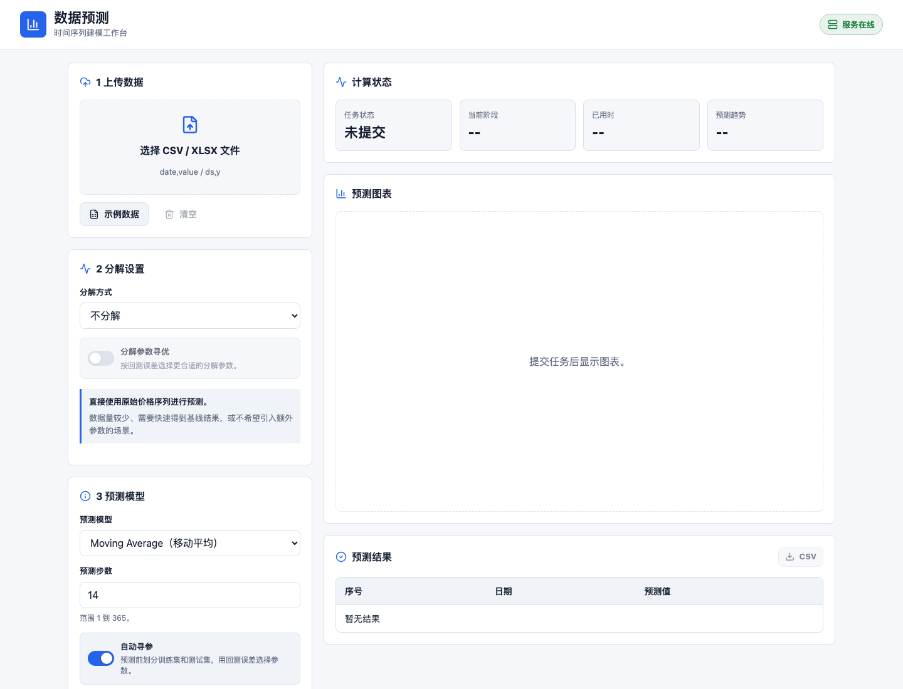
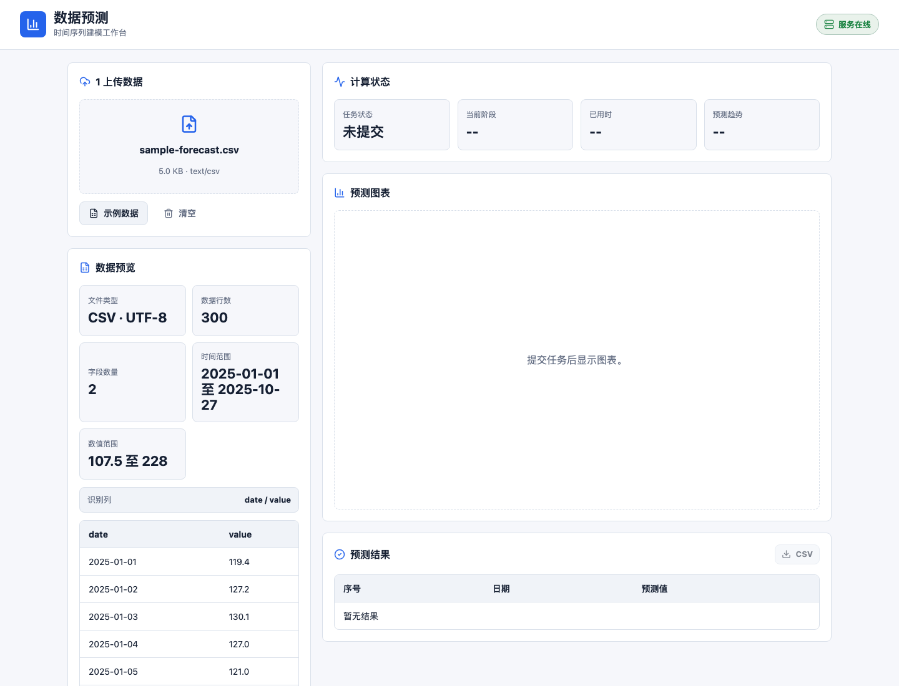
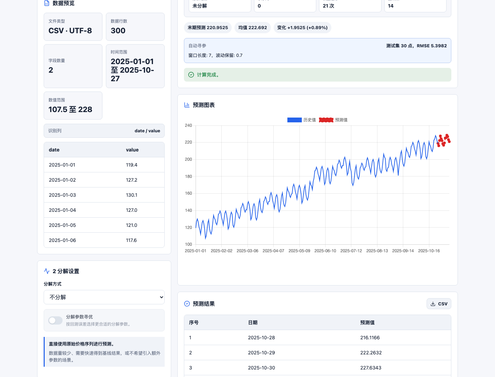

# 数据预测网站

一个前后端分离的时间序列预测工作台。前端负责上传、预览、配置和结果展示；后端负责文件解析、模型寻参、异步计算和预测结果封装。

<p align="center">
  
</p>

## 页面预览

| 数据导入与字段预览 | 预测结果与图表 |
| --- | --- |
|  |  |

## 一眼看懂

| 步骤 | 页面操作 | 系统输出 |
| --- | --- | --- |
| 1. 准备数据 | 上传 CSV/XLSX，或加载示例数据 | 自动识别时间列、数值列、行数、时间范围和数值范围 |
| 2. 配置模型 | 选择分解方式、预测模型、预测步数和参数 | 支持手动参数，也支持基于回测误差自动寻参 |
| 3. 提交计算 | 点击开始计算 | 后端异步执行，前端轮询任务状态和进度 |
| 4. 查看结果 | 查看趋势、图表和结果表格 | 可导出未来预测点 CSV |

## 核心能力

| 能力 | 说明 |
| --- | --- |
| 数据上传 | 支持 CSV 和 XLSX；CSV 支持 UTF-8 与常见 GB18030 中文编码 |
| 数据预览 | 前端展示字段、行数、时间范围、数值范围和前几行数据 |
| 序列分解 | 支持不分解、VMD、SSA、EWT，将原始序列拆成多个子序列后分别预测 |
| 自动寻参 | 分解参数和预测模型参数都可通过时间顺序回测选择更优组合 |
| 波动保留 | 将历史短期波动模式加入未来预测，避免结果过度平滑 |
| 异步任务 | FastAPI 后端创建预测任务，前端自动轮询任务状态 |
| 可视化导出 | 折线图展示历史值和预测值，结果表格支持导出 CSV |

## 技术栈

| 层 | 技术 |
| --- | --- |
| 前端 | Vite、React、TypeScript、Chart.js、lucide-react |
| 后端 | Python、FastAPI、Pydantic、NumPy、Uvicorn |
| 算法 | 分解模型、预测模型、组合权重算法统一放在 `algorithm/` |

## 快速启动

后端默认运行在 `http://localhost:8000`：

```bash
cd backend
python3 -m venv .venv
source .venv/bin/activate
pip install -r requirements.txt
uvicorn app.main:app --reload --port 8000
```

如果当前环境不允许文件监听，可以去掉 `--reload`：

```bash
uvicorn app.main:app --port 8000
```

前端默认运行在 `http://localhost:5173`：

```bash
cd frontend
npm install
npm run dev
```

打开前端地址后，页面会自动检测后端健康状态。

## 数据格式

上传文件至少包含时间列和数值列。推荐字段名：

```csv
date,value
2025-01-01,120
2025-01-02,132
2025-01-03,128
```

| 字段 | 可识别名称 | 要求 |
| --- | --- | --- |
| 时间列 | `date`、`time`、`ds` | 支持常见日期格式 |
| 数值列 | `value`、`y`、`target` | 必须能转换为数字 |

XLSX 会读取首个工作表，表头同样使用上面的字段名。

## API 概览

| 方法 | 路径 | 用途 |
| --- | --- | --- |
| `GET` | `/api/health` | 服务健康检查 |
| `GET` | `/api/models` | 获取预测模型列表和参数说明 |
| `GET` | `/api/decompositions` | 获取分解模型列表和参数说明 |
| `POST` | `/api/forecast` | 上传数据并创建预测任务 |
| `GET` | `/api/forecast/{job_id}` | 查询任务状态和预测结果 |

后端启动后也可以打开 `http://localhost:8000/docs` 查看 Swagger 文档。

## 已实现模型

### 分解模型

| 模型 | 说明 |
| --- | --- |
| 不分解 | 直接使用原始序列预测，适合快速基线 |
| VMD | 变分模态分解，将序列拆成多个 IMF 分量并保留残差 |
| SSA | 奇异谱分析，通过轨迹矩阵和 SVD 重构趋势/振荡分量 |
| EWT | 经验小波分解，按频谱局部峰值划分频带并提取子序列 |

### 预测模型

| 模型 | 说明 |
| --- | --- |
| Naive Forecast | 使用最后一个观测值作为未来预测 |
| Moving Average | 使用最近 `window` 个观测值的均值递推预测 |
| Simple Exponential Smoothing | 使用 `alpha` 控制近期数据权重 |
| Linear Trend | 拟合线性趋势并向未来延伸 |
| ETS | 使用水平、趋势和可选季节项生成预测 |
| ELM | 使用随机隐藏层和岭回归进行非线性递推预测 |
| LSTM | 使用轻量门控循环单元编码历史窗口并训练输出层 |

## 项目结构

```text
.
├── algorithm
│   ├── decomposition        # VMD / SSA / EWT 等分解算法
│   ├── forecasting          # 预测模型运行时
│   └── weight_allocation    # PSO-CS 等组合权重算法
├── backend
│   ├── app                  # FastAPI 接口、任务编排、数据模型
│   └── requirements.txt
├── docs
│   └── images               # README 页面截图
└── frontend
    ├── src                  # React 页面、接口封装、样式
    └── package.json
```
